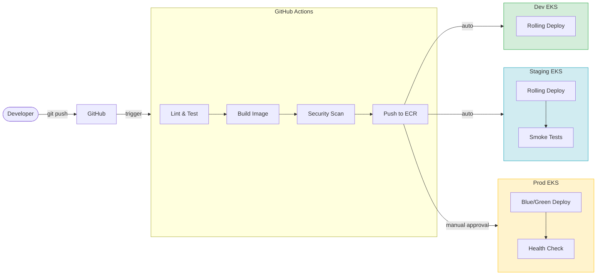

# Deployment Flow

```mermaid
flowchart LR
    dev([Developer]) -->|git push| gh[GitHub]
    gh -->|trigger| ci[CI Pipeline]

    subgraph ci [GitHub Actions]
        lint[Lint & Test] --> build[Build Image]
        build --> scan[Security Scan]
        scan --> push[Push to ECR]
    end

    push -->|auto| dev_env[Dev]
    push -->|auto| stg_env[Staging]
    push -->|manual approval| prod_env[Prod]

    subgraph dev_env [Dev EKS]
        d_deploy[Rolling Deploy]
    end

    subgraph stg_env [Staging EKS]
        s_deploy[Rolling Deploy]
        s_smoke[Smoke Tests]
        s_deploy --> s_smoke
    end

    subgraph prod_env [Prod EKS]
        p_deploy[Blue/Green Deploy]
        p_health[Health Check]
        p_deploy --> p_health
    end

    style prod_env fill:#fff3cd,stroke:#ffc107
    style stg_env fill:#d1ecf1,stroke:#17a2b8
    style dev_env fill:#d4edda,stroke:#28a745
```
