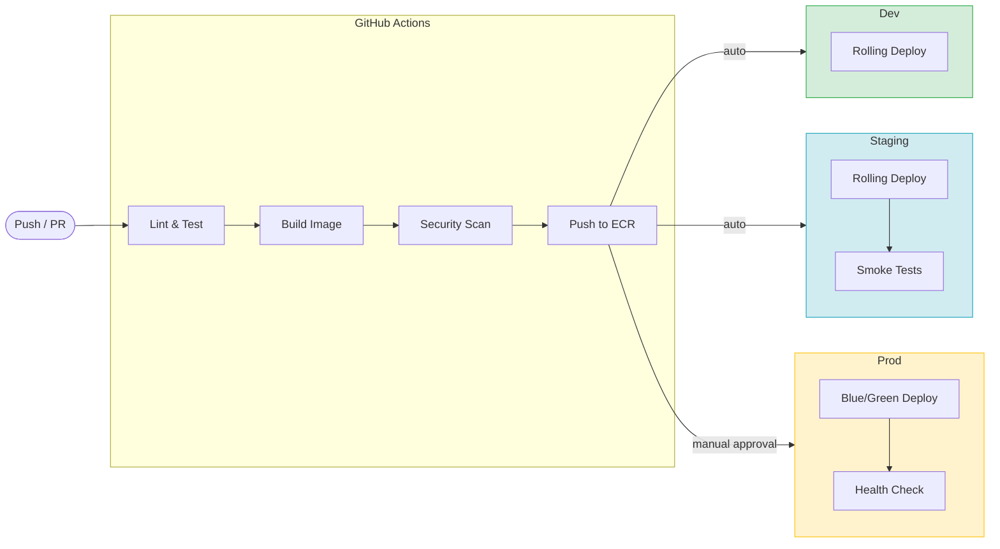

# GitHub Actions Pipeline

```mermaid
flowchart LR
    push([Push / PR]) --> lint

    subgraph ci [GitHub Actions]
        lint[Lint & Test] --> build[Build Image]
        build --> scan[Security Scan]
        scan --> ecr[Push to ECR]
    end

    ecr -->|auto| dev
    ecr -->|auto| staging
    ecr -->|manual approval| prod

    subgraph dev [Dev]
        d[Rolling Deploy]
    end

    subgraph staging [Staging]
        s[Rolling Deploy] --> st[Smoke Tests]
    end

    subgraph prod [Prod]
        p[Blue/Green Deploy] --> ph[Health Check]
    end

    style prod fill:#fff3cd,stroke:#ffc107
    style staging fill:#d1ecf1,stroke:#17a2b8
    style dev fill:#d4edda,stroke:#28a745
```
