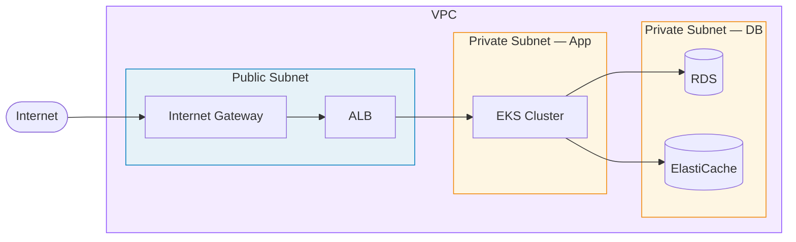

# AWS Three-Tier Architecture

```mermaid
flowchart LR
    internet([Internet]) --> igw[Internet Gateway]

    subgraph vpc [VPC]
        subgraph public [Public Subnet]
            igw --> alb[ALB]
        end

        subgraph app [Private Subnet — App]
            eks[EKS Cluster]
        end

        subgraph db [Private Subnet — DB]
            rds[(RDS)]
            cache[(ElastiCache)]
        end
    end

    alb --> eks
    eks --> rds
    eks --> cache

    style public fill:#e6f2f8,stroke:#007CBE
    style app fill:#fef6e3,stroke:#F18702
    style db fill:#fef6e3,stroke:#F18702
    style vpc fill:#f4ebff,stroke:#8C4FFF
```
