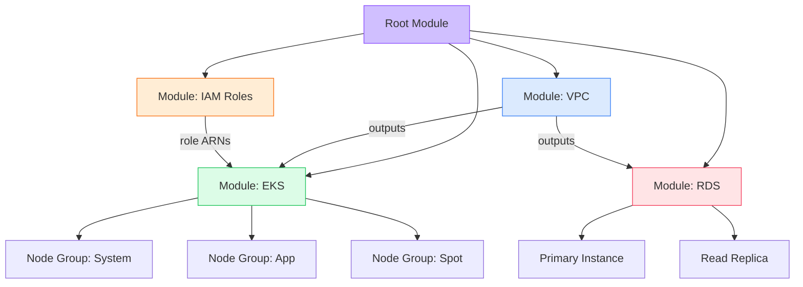
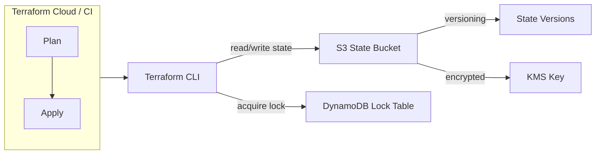

# Terraform Module Structure

```mermaid
graph TD
    root[Root Module] --> vpc[Module: VPC]
    root --> eks[Module: EKS]
    root --> rds[Module: RDS]
    root --> iam[Module: IAM Roles]

    vpc -->|outputs| eks
    vpc -->|outputs| rds
    iam -->|role ARNs| eks

    eks --> ng1[Node Group: System]
    eks --> ng2[Node Group: App]
    eks --> ng3[Node Group: Spot]

    rds --> primary[Primary Instance]
    rds --> replica[Read Replica]

    style root fill:#d0bfff,stroke:#8C4FFF
    style vpc fill:#dbeafe,stroke:#3b82f6
    style eks fill:#dcfce7,stroke:#22c55e
    style rds fill:#ffe4e6,stroke:#f43f5e
    style iam fill:#ffedd5,stroke:#f97316
```

---

# State Backend Architecture

```mermaid
flowchart LR
    tf[Terraform CLI] -->|read/write state| s3[S3 State Bucket]
    tf -->|acquire lock| ddb[DynamoDB Lock Table]
    s3 -->|versioning| versions[State Versions]
    s3 -->|encrypted| kms[KMS Key]

    subgraph tfc[Terraform Cloud / CI]
        plan[Plan] --> apply[Apply]
    end

    tfc --> tf
```
