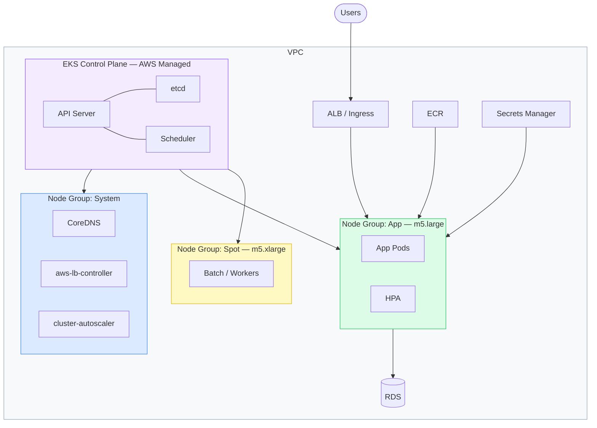

# EKS Cluster Architecture

```mermaid
flowchart TD
    internet([Users]) --> alb[ALB / Ingress]

    subgraph vpc [VPC]
        alb

        subgraph cp [EKS Control Plane — AWS Managed]
            api[API Server] --- etcd[etcd]
            api --- sched[Scheduler]
        end

        subgraph ng_system [Node Group: System]
            coredns[CoreDNS]
            lbc[aws-lb-controller]
            ca[cluster-autoscaler]
        end

        subgraph ng_app [Node Group: App — m5.large]
            pods[App Pods]
            hpa[HPA]
        end

        subgraph ng_spot [Node Group: Spot — m5.xlarge]
            workers[Batch / Workers]
        end

        ecr[ECR] --> ng_app
        sm[Secrets Manager] --> ng_app
        ng_app --> rds[(RDS)]
    end

    alb --> ng_app
    cp --> ng_system
    cp --> ng_app
    cp --> ng_spot

    style cp fill:#f4ebff,stroke:#8C4FFF
    style ng_system fill:#dbeafe,stroke:#3b82f6
    style ng_app fill:#dcfce7,stroke:#22c55e
    style ng_spot fill:#fef9c3,stroke:#eab308
    style vpc fill:#f8f9fa,stroke:#94a3b8
```
