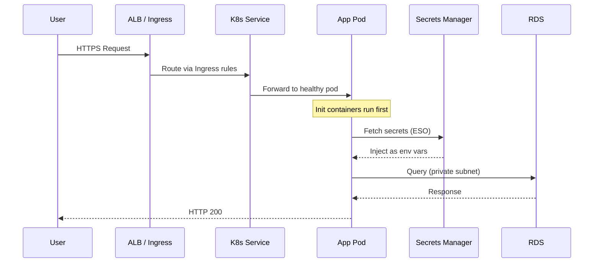
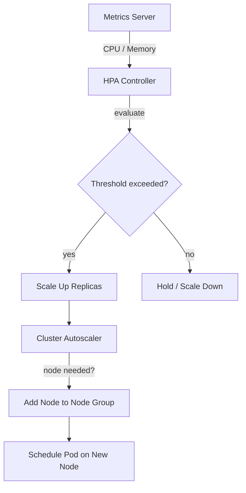

# Pod Lifecycle & Traffic Flow

```mermaid
sequenceDiagram
    participant User
    participant ALB as ALB / Ingress
    participant Svc as K8s Service
    participant Pod as App Pod
    participant Secrets as Secrets Manager
    participant DB as RDS

    User->>ALB: HTTPS Request
    ALB->>Svc: Route via Ingress rules
    Svc->>Pod: Forward to healthy pod

    Note over Pod: Init containers run first
    Pod->>Secrets: Fetch secrets (ESO)
    Secrets-->>Pod: Inject as env vars

    Pod->>DB: Query (private subnet)
    DB-->>Pod: Response
    Pod-->>User: HTTP 200
```

---

# HPA Scaling Decision

```mermaid
flowchart TD
    metrics[Metrics Server] -->|CPU / Memory| hpa[HPA Controller]
    hpa -->|evaluate| check{Threshold exceeded?}
    check -->|yes| scale[Scale Up Replicas]
    check -->|no| hold[Hold / Scale Down]
    scale --> ca[Cluster Autoscaler]
    ca -->|node needed?| ng[Add Node to Node Group]
    ng --> schedule[Schedule Pod on New Node]
```
