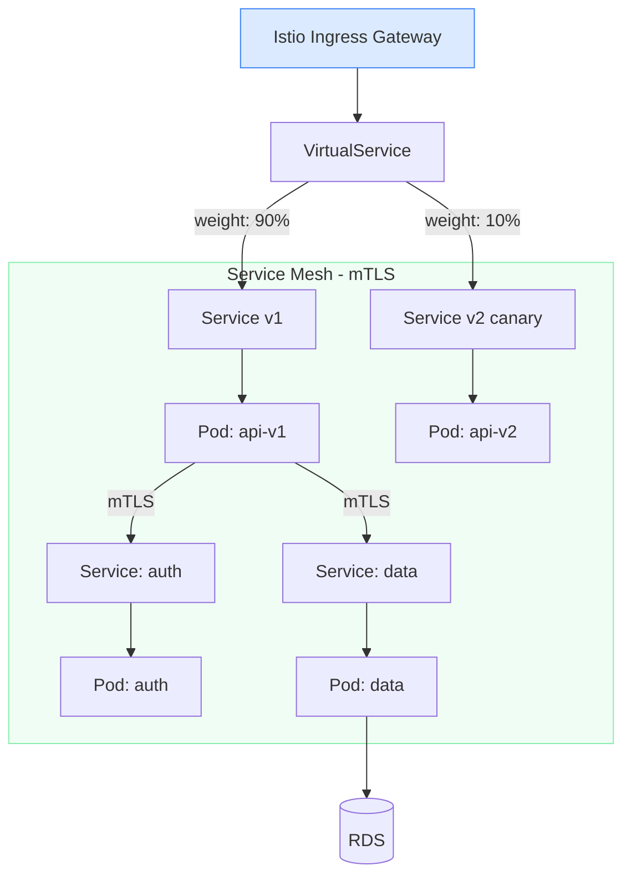

# Service Mesh Traffic Flow (Istio / App Mesh)

```mermaid
flowchart TD
    ig[Istio Ingress Gateway] --> vs[VirtualService]

    vs -->|weight: 90%| svc_v1[Service v1]
    vs -->|weight: 10%| svc_v2[Service v2 canary]

    subgraph mesh [Service Mesh - mTLS]
        svc_v1 --> pod_a[Pod: api-v1]
        svc_v2 --> pod_b[Pod: api-v2]

        pod_a -->|mTLS| svc_b[Service: auth]
        pod_a -->|mTLS| svc_c[Service: data]
        svc_b --> pod_auth[Pod: auth]
        svc_c --> pod_data[Pod: data]
    end

    pod_data --> db[(RDS)]

    style mesh fill:#f0fdf4,stroke:#86efac
    style ig fill:#dbeafe,stroke:#3b82f6
```
