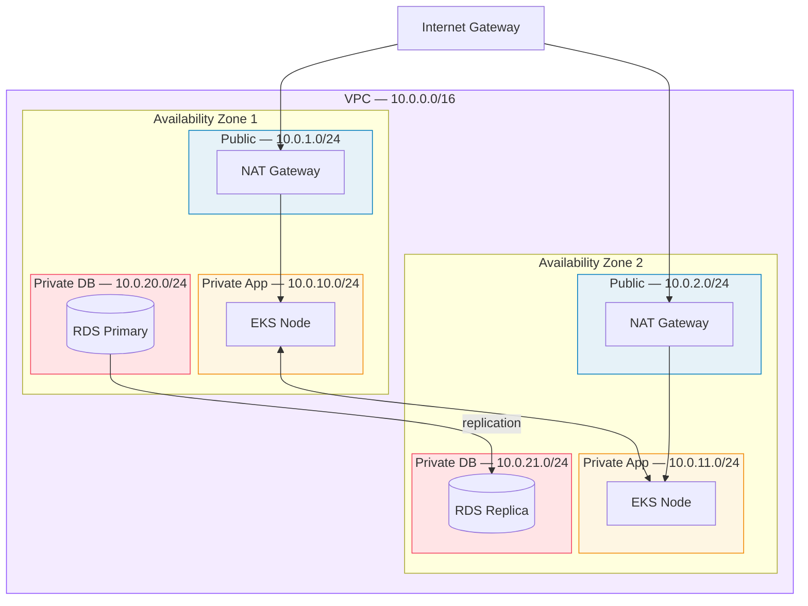

# Multi-AZ VPC Design

```mermaid
flowchart TB
    igw[Internet Gateway]

    subgraph vpc [VPC — 10.0.0.0/16]
        subgraph az1 [Availability Zone 1]
            subgraph pub1 [Public — 10.0.1.0/24]
                nat1[NAT Gateway]
            end
            subgraph app1 [Private App — 10.0.10.0/24]
                eks1[EKS Node]
            end
            subgraph db1 [Private DB — 10.0.20.0/24]
                rds1[(RDS Primary)]
            end
        end

        subgraph az2 [Availability Zone 2]
            subgraph pub2 [Public — 10.0.2.0/24]
                nat2[NAT Gateway]
            end
            subgraph app2 [Private App — 10.0.11.0/24]
                eks2[EKS Node]
            end
            subgraph db2 [Private DB — 10.0.21.0/24]
                rds2[(RDS Replica)]
            end
        end
    end

    igw --> nat1
    igw --> nat2
    nat1 --> eks1
    nat2 --> eks2
    eks1 <--> eks2
    rds1 -->|replication| rds2

    style pub1 fill:#e6f2f8,stroke:#007CBE
    style pub2 fill:#e6f2f8,stroke:#007CBE
    style app1 fill:#fef6e3,stroke:#F18702
    style app2 fill:#fef6e3,stroke:#F18702
    style db1 fill:#ffe4e6,stroke:#f43f5e
    style db2 fill:#ffe4e6,stroke:#f43f5e
    style vpc fill:#f4ebff,stroke:#8C4FFF
```
